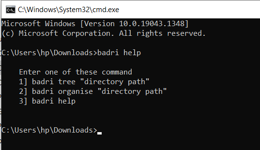

# XYplorer

It is a global command line application using Node.js. It organizes all your files from from a folder into different section so that you need not to do it manually.


## Demo

https://youtu.be/XLvvBAX35g8

## Run Locally

Clone the project

```bash
  git clone https://github.com/vishal8803/XYplorer.git
```

Go to the project directory

```bash
  cd file_organiser
```

Install dependencies

```bash
  npm install
```

Run Command

```bash
  badri help
```


## Tech Stack

**Client:** NodeJS


## Screenshots



